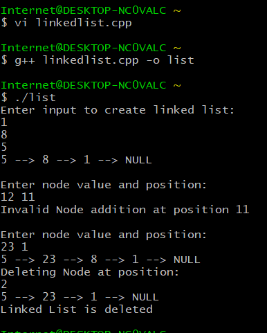

## Linked list

Application of linked list via class and concept of inheritance in C++

```cpp
#include <iostream>
using namespace std;

class Node {
    public:
        union Value {
            int num;
            char ch;
            float decimal;
        } val; 
        
        Node* next;
};

class LinkedList {
protected:
    int len;
    Node* head;

public:
    typedef Node::Value ListValue;

    LinkedList() {
        head = nullptr;
        len = 0;
    }
    
    ~LinkedList() {
        Node* current = head;
        while (current != nullptr) {
            Node* temp = current->next;
            delete current;
            current = temp;
        }
        cout << "Linked List is deleted\n";
    }
    
    void addNode(ListValue input, int pos) {
        if (pos > len || pos < 0) {
            cout << "Invalid Node addition at position " << pos << "\n";
            return;
        }

        Node* newNode = new Node();
        newNode->val = input;
        newNode->next = nullptr;
        
        if (pos == 0) {
            newNode->next = head;
            head = newNode;
        }
        else {
            Node* temp = head;
            for (int i = 0; i < pos - 1; i++) {
                temp = temp->next;
            }
            newNode->next = temp->next;
            temp->next = newNode;
        }
        
        len += 1;
    }
    
    void deleteNode(int pos) {
        if (pos >= len || pos < 0 || head == nullptr) {
            cout << "Invalid Node deletion at position " << pos << "\n";
            return;
        }

        Node* temp = nullptr;
        if (pos == 0) {
            temp = head;
            head = head->next;
            delete temp;
        }
        
        else {
            Node* prev = head;
            for (int i = 0; i < pos - 1; i++) {
                prev = prev->next;
            }
            temp = prev->next;
            prev->next = temp->next;
            delete temp;
        }

        len -= 1;
    }
    
    int getLength()
    {
        return len;
    }

    void display(int ptr) {
        Node* temp = head;
        
        while (ptr > 0 && temp != nullptr) 
        {
            cout << temp->val.num << " --> ";
            temp = temp->next;
            ptr -= 1;
        }
        cout << "NULL\n";
}

};

int main() {
    LinkedList* list = new LinkedList();
    LinkedList::ListValue input;
    int pos=-1;

    cout << "Enter input to create linked list: " << endl;
    for (int i = 0; i < 3; i++) {
        cin >> input.num;
        list->addNode(input, 0);
    }
    
    list->display(list->getLength());
    cout << endl << "Enter node value and position: " << endl;
    cin >> input.num >> pos;
    list->addNode(input, pos);

    cout << endl <<"Enter node value and position: " <<endl;
    cin >> input.num >>pos;
    list->addNode(input, pos);
    
    list->display(list->getLength());
    
    cout << "Deleting Node at position: " << endl;
    cin >> pos;
    list->deleteNode(pos);
    list->display(list->getLength());
    
    delete list;
    return 0;
}
```

